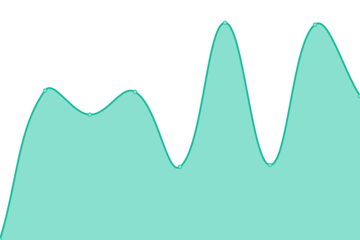

# [📈 Live Status](https://www.d4kstatus.net): <!--live status--> **🟩 All systems operational**

This repository contains the open-source uptime monitor and status page for [D4K Hosting](www.d4khosting.ca), powered by [Upptime](https://github.com/upptime/upptime).

With [Upptime](https://upptime.js.org), you can get your own unlimited and free uptime monitor and status page, powered entirely by a GitHub repository. We use [Issues](https://github.com/d4khosting/uptime-d4kstatus-net/issues) as incident reports, [Actions](https://github.com/d4khosting/uptime-d4kstatus-net/actions) as uptime monitors, and [Pages](https://www.d4kstatus.net) for the status page.

<!--start: status pages-->
<!-- This summary is generated by Upptime (https://github.com/upptime/upptime) -->
<!-- Do not edit this manually, your changes will be overwritten -->
<!-- prettier-ignore -->
| URL | Status | History | Response Time | Uptime |
| --- | ------ | ------- | ------------- | ------ |
|  [CAN East Server (Montreal)](https://vps.d4kservers.net) | 🟩 Up | [can-east-server-montreal.yml](https://github.com/d4khosting/uptime-d4kstatus-net/commits/HEAD/history/can-east-server-montreal.yml) | 

 310ms
     
 | 

<a href="https://www.d4kstatus.net/history/can-east-server-montreal">100.00%</a>
    

<!--end: status pages-->

[**Visit our status website →**](https://www.d4kstatus.net)

## 📄 License

- Powered by: [Upptime](https://github.com/upptime/upptime)
- Code: [MIT](./LICENSE) © [Anand Chowdhary](https://anandchowdhary.com), supported by [Pabio](https://pabio.com)
- Data in the `./history` directory: [Open Database License](https://opendatacommons.org/licenses/odbl/1-0/)
